# SynOS – Full ERD (Mermaid)

```mermaid
erDiagram
  %% --- Core Patient/Visit/Order/Result ---
  Patients ||--o{ Visits : has
  Visits   ||--o{ Orders : has
  Orders   ||--o{ Samples : has
  Orders   ||--o{ Results : yields
  Visits   ||--o{ ImagingStudies : includes
  Visits   ||--o{ Reports : produces
  Reports  ||--o{ DeliveryLogs : logged_by
  Referrers||--o{ Visits : referred_by
  Users    ||--o{ Reports : signed_by
  Users    ||--o{ Results : entered_by
  Users    ||--o{ Results : verified_by

  Patients {
    string  PatientId PK   "Permanent 6-char Base36"
    string  MRN
    string  Name
    date    DOB
    string  Sex
    string  Phone
    datetime CreatedAt
    rowversion RowVersion
  }

  Visits {
    string  VisitId PK
    string  PatientId FK
    string  Token         "e.g., P-001/X-023; per-day dept queue"
    date    TokenDate     "daily reset key"
    string  Dept          "Pathology/XR/MRI/CT"
    string  ReferrerId FK
    string  Status
    datetime CreatedAt
    rowversion RowVersion
  }

  Orders {
    string  OrderId PK
    string  VisitId FK
    string  TestCode
    string  Dept
    decimal Price
    decimal Discount
    string  Status
    datetime CreatedAt
  }

  Samples {
    string  SampleId PK
    string  OrderId FK
    string  TubeType
    string  Barcode
    datetime CollectedAt
    string  Status
  }

  Results {
    string  ResultId PK
    string  OrderId FK
    string  ParamCode
    decimal Value
    string  Unit
    decimal RefLow
    decimal RefHigh
    string  Flag
    string  EnteredBy FK
    string  VerifiedBy FK
    datetime EnteredAt
    datetime VerifiedAt
  }

  ImagingStudies {
    string  StudyId PK
    string  VisitId FK
    string  Modality     "XR/MRI/CT"
    string  DicomPath
    string  Status
    datetime CompletedAt
  }

  Reports {
    string  ReportId PK
    string  VisitId FK
    string  Dept
    string  PdfPath
    int     Version
    string  SignedBy FK
    datetime SignedAt
  }

  DeliveryLogs {
    string  DeliveryId PK
    string  ReportId FK
    string  Method      "Print/WhatsApp/Email/Link"
    string  Recipient
    json    Meta
    datetime DeliveredAt
  }

  Referrers {
    string  ReferrerId PK
    string  Name
    string  CommissionRule  "e.g., 10-20%"
    bool    PrepaidAllowed
  }

  Users {
    string  UserId PK
    string  Name
    string  RoleId
    string  Dept
    string  Phone
    bool    IsActive
  }

  Roles ||--o{ Users : assigns
  Roles {
    string  RoleId PK
    string  Name
  }

  %% --- Finance (Billing/Payments) ---
  Visits  ||--o{ Invoices : billed_by
  Invoices||--o{ Payments : paid_by

  Invoices {
    string  InvoiceId PK
    string  VisitId FK
    decimal Amount
    decimal Discount
    decimal NetAmount
    bool    IsPaid
    datetime CreatedAt
  }

  Payments {
    string  PaymentId PK
    string  InvoiceId FK
    string  Method      "Cash/Card/UPI/Prepaid/Corporate"
    decimal Amount
    string  RefNo
    datetime PaidAt
  }

  %% --- Part 6: Inventory & Reagents ---
  InventoryItems ||--o{ InventoryLots : has
  InventoryLots  ||--o{ InventoryMovements : tracked
  Tests          ||--o{ TestReagents : maps

  InventoryItems {
    string  ItemId PK
    string  Name
    string  Type          "Reagent/Tube/Consumable"
    string  Unit
    string  Storage       "e.g., 2-8C"
    string  Vendor
  }

  InventoryLots {
    string  LotId PK
    string  ItemId FK
    string  BatchNo
    date    Expiry
    int     QtyOnHand
    decimal UnitCost
  }

  InventoryMovements {
    string  MoveId PK
    string  LotId FK
    int     Qty
    string  Reason        "IN/OUT/Wastage/Adjust"
    string  PerformedBy FK
    datetime MovedAt
  }

  Tests {
    string  TestCode PK
    string  Name
    string  Dept
    string  Category
  }

  TestReagents {
    string  TestCode FK
    string  ItemId  FK
    decimal QtyPerTest
  }

  %% --- Part 6: Outsourcing ---
  OutsourcePartners ||--o{ OutsourceDispatches : has
  OutsourceDispatches ||--o{ OutsourceResults : returns

  OutsourcePartners {
    string  PartnerId PK
    string  Name
    string  Contact
    string  TAT
  }

  OutsourceDispatches {
    string  DispatchId PK
    string  PartnerId FK
    string  OrderId   FK
    datetime DispatchedAt
    string  Status
    string  ManifestPath
  }

  OutsourceResults {
    string  ResultImportId PK
    string  DispatchId FK
    string  PdfPath
    datetime ImportedAt
  }

  %% --- Part 6: Critical Values ---
  CriticalAlerts {
    string  AlertId PK
    string  ResultId FK
    string  Threshold
    string  NotifiedTo
    datetime NotifiedAt
    string  AckBy
    datetime AckAt
    string  Escalation
  }

  %% --- Part 6: Accreditation ---
  Equipment ||--o{ Calibrations : requires
  Documents ||--o{ DocumentVersions : versioned
  CAPA      ||--o{ CAPAActions : has

  Equipment {
    string  EquipmentId PK
    string  Name
    string  SerialNo
    string  Location
  }

  Calibrations {
    string  CalibrationId PK
    string  EquipmentId FK
    date    DueDate
    date    DoneDate
    string  Status
    string  CertificatePath
  }

  Documents {
    string  DocumentId PK
    string  Name
    string  Category
  }

  DocumentVersions {
    string  VersionId PK
    string  DocumentId FK
    int     VersionNo
    string  FilePath
    datetime PublishedAt
  }

  CAPA {
    string  CAPAId PK
    string  Title
    string  Status
    datetime OpenedAt
  }

  CAPAActions {
    string  ActionId PK
    string  CAPAId  FK
    string  OwnerId FK
    string  Action
    datetime DueAt
    datetime ClosedAt
  }

  %% --- Part 8: DICOM Viewer & Report Designer ---
  ImagingStudies ||--o{ KeyImages : has
  ImagingStudies ||--o{ Measurements : includes
  ReportTemplates ||--o{ TemplateVersions : versioned
  Visits ||--o{ RenderedReports : generated_for

  KeyImages {
    string  KeyImageId PK
    string  StudyId FK
    string  SeriesUid
    string  SopUid
    int     Frame
    string  Reason
    string  CreatedBy
    datetime CreatedAt
  }

  Measurements {
    string  MeasurementId PK
    string  StudyId FK
    string  Tool
    json    DataJson
    string  SeriesUid
    string  SopUid
    int     Frame
    string  CreatedBy
    datetime CreatedAt
  }

  ReportTemplates {
    string  TemplateId PK
    string  Name
    string  Dept
    string  Category
    string  Status
    datetime CreatedAt
    string  CreatedBy
  }

  TemplateVersions {
    string  VersionId PK
    string  TemplateId FK
    int     VersionNumber
    json    JsonDefinition
    datetime PublishedAt
    string  PublishedBy
  }

  RenderedReports {
    string  RenderId PK
    string  VisitId FK
    string  TemplateId FK
    string  VersionId  FK
    string  PdfPath
    json    ContextMeta
    datetime RenderedAt
  }

  %% --- HR & Payroll ---
  Staff ||--o{ Attendance : logs
  Staff ||--o{ Payslips   : paid
  Staff {
    string  StaffId PK
    string  Name
    string  RoleId FK
    string  Dept
    date    JoinDate
    bool    Active
  }
  Attendance {
    string  AttendanceId PK
    string  StaffId FK
    date    Day
    string  Status    "P/A/L/WO"
    decimal OvertimeHours
  }
  Payroll {
    string  PayrollId PK
    string  StaffId FK
    string  Month     "YYYY-MM"
    decimal Basic
    decimal Allowances
    decimal Deductions
    decimal NetPay
  }
  Payslips {
    string  PayslipId PK
    string  PayrollId FK
    string  FilePath
    datetime GeneratedAt
  }
```


erDiagram
  %% --- Actors
  Users ||--o{ Backups : created_by
  Users ||--o{ RestoreJobs : initiated_by

  %% --- Core backup entities
  Backups ||--o{ BackupFiles   : contains
  Backups ||--o{ BackupEvents  : logged_by
  RestoreJobs ||--o{ RestoreEvents : logged_by

  %% --- Tables

  Users {
    string UserId PK
    string Name
    string RoleId
  }

  Backups {
    string  BackupId PK
    string  Kind          "scheduled | manual"
    string  Scope         "db | files | db_files"
    string  Status        "pending | running | success | failed"
    string  StartedBy FK  "Users.UserId (nullable for scheduled)"
    datetime StartedAt
    datetime CompletedAt
    string  StoragePath   "root folder for this backup"
    string  Verification  "checksum/hash summary"
    string  Notes
  }

  BackupFiles {
    string  BackupFileId PK
    string  BackupId FK
    string  FileType      "db_full | db_log | reports | dicom | templates | configs"
    string  FilePath
    bigint  SizeBytes
    string  Checksum
  }

  BackupEvents {
    string  BackupEventId PK
    string  BackupId FK
    datetime At
    string  Level         "info | warn | error"
    string  Message
  }

  RestoreJobs {
    string  RestoreJobId PK
    string  BackupId FK
    string  Mode          "full | point_in_time"
    datetime TargetTime   "nullable for full"
    string  Status        "pending | staging | restoring | verifying | completed | failed"
    string  InitiatedBy FK
    datetime StartedAt
    datetime CompletedAt
    string  Notes
  }

  RestoreEvents {
    string  RestoreEventId PK
    string  RestoreJobId FK
    datetime At
    string  Step          "maintenance_on | stop_services | db_restore | files_restore | start_services | healthcheck"
    string  Level         "info | warn | error"
    string  Message
  }
erDiagram
  %% --- Core identity & visit
  Patients ||--o{ Visits : has
  Visits   ||--o{ Orders : has
  Visits   ||--o{ Reports : produces

  %% --- Queue tracking (token calls for lobby)
  Visits   ||--o{ TokenCalls : calls

  %% --- Tables

  Patients {
    string  PatientId PK   "Permanent 6-char (Base36)"
    string  MRN
    string  Name
    date    DOB
    string  Sex
    string  Phone
    datetime CreatedAt
  }

  Visits {
    string  VisitId PK
    string  PatientId FK
    string  Dept          "P|X|M|C (Path/Xray/MRI/CT)"
    string  Token         "e.g., P-001 (resets daily per dept)"
    date    TokenDate     "midnight reset key"
    string  Status
    datetime CreatedAt
  }

  Orders {
    string  OrderId PK
    string  VisitId FK
    string  TestCode
    string  Dept
    decimal Price
    decimal Discount
    string  Status
    datetime CreatedAt
  }

  Reports {
    string  ReportId PK
    string  VisitId FK
    string  Dept
    string  PdfPath
    int     Version
    string  SignedBy
    datetime SignedAt
  }

  TokenCalls {
    string  CallId PK
    string  VisitId FK
    datetime CalledAt
    string  Channel      "speaker | display | sms"
    string  ByUserId     "nullable (auto system)"
    string  Note
  }
# SynOS – ERD (Part 11: Analytics, Test Master & Audit)

```mermaid
erDiagram
  %% Tests & Parameters
  Tests ||--o{ Parameters : has

  Tests {
    string  TestId PK
    string  TestCode UNIQUE
    string  TestName
    string  Department
    string  Category
    decimal BasePrice
    bool    IsActive
    datetime CreatedAt
  }

  Parameters {
    string  ParameterId PK
    string  TestId FK
    string  ParameterCode
    string  ParameterName
    string  Unit
    decimal RefLow
    decimal RefHigh
    decimal CriticalLow
    decimal CriticalHigh
    bool    IsActive
  }

  %% Users & Audit
  Users ||--o{ AuditLog : writes

  Users {
    string  UserId PK
    string  Email UNIQUE
    string  FullName
    string  RoleId FK
    string  Department
    bool    MFAEnabled
    datetime LastLogin
    bool    IsActive
    datetime CreatedAt
  }

  AuditLog {
    string  AuditLogId PK
    string  UserId FK
    string  Action
    string  Entity
    string  EntityId
    text    OldValue
    text    NewValue
    datetime Timestamp
    string  IPAddress
    json    Details
  }
```