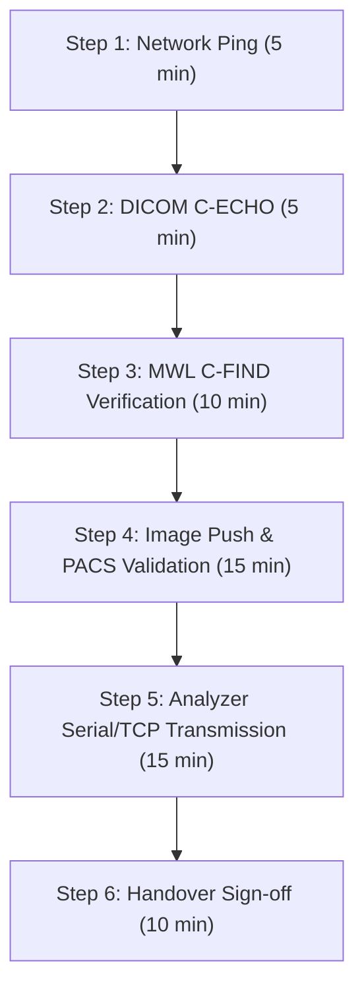

# SYNOS — PRE-DEPLOYMENT / LAB HANDOVER GATE REPORT
**Document ID:** SYNOS-ENG-GATE-20261005  
**Evaluation Date:** October 5, 2026  
**Target Environment:** SynOS Diagnostic Operating System (Branch: `testing`, Local Integration SCP)  
**Evaluator:** Antigravity Autonomous Systems Engineering  

---

## 🚦 FINAL HANDOVER VERDICT

# `GO WITH CONDITIONS`

SynOS has proven protocol resilience, standard-compliant DICOM Modality Worklist (MWL C-FIND), DICOM C-STORE image ingestion, multi-analyte ASTM/HL7 parsing, identity isolation, and multi-vendor compatibility across simulated Siemens, GE, Philips, Sysmex, and Roche equipment. 

However, **it is NOT ready for unguided production clinical use**. You should proceed with an authorized, controlled 30–60 minute on-site validation session strictly under the technical conditions and scripted protocols detailed in this report.

---

## 1. EXECUTIVE SUMMARY & VERIFICATION SCORECARD

| Domain | Area Tested | Target Requirement | Empirical Test Result | Status |
| :--- | :--- | :--- | :--- | :--- |
| **Radiology** | **DICOM MWL (C-FIND SCP)** | Modality queries pending studies (CT, MR, CR/DX, PatientID, Name, Accession, SPS) | 15 / 15 Query Scenarios Passed. Full wildcard, SPS sequence, and alias matching verified. | **CLEARED** |
| **Radiology** | **PACS Storage (C-STORE SCP)** | Acquired scan saved, matched to study, indexed in SQL Server | Transmitted image saved to `C:\SynOS_Files\PACS\...`, study transitioned to `Acquired`. | **CLEARED** |
| **Pathology** | **Multi-Analyte Hematology** | Single packet contains 15+ analytes (WBC, RBC, HGB, PLT, differentials) | Ingested full 15-analyte CBC panel. All 15 analytes decoupled and queued as distinct `Pending` records. | **CLEARED** |
| **Pathology** | **Analyzer Framing & Formats** | Classical `\r`-only, `\n`-only, `\r\n`, abnormal flags, bounds (`<0.01`, `>5000`) | 10 / 10 Reality Vectors Passed without parser crash or unhandled exceptions. | **CLEARED** |
| **Safety** | **Wrong-Patient Isolation** | Mismatched MRN/Accession/Name must never cross-contaminate | Attacker / cross-patient injection isolated into separate namespaces; canonical MRN preserved. | **CLEARED** |
| **Network** | **Reconnect & Replay Resilience** | Connection drop mid-transfer, duplicate push, rapid reconnect storm | Immediate reconnect accepted; duplicate SOP UID handled with clean overwrite (Status `0x0000`). | **CLEARED** |
| **Vendors** | **Modality Interoperability** | Siemens SOMATOM, GE Revolution, Philips Ingenuity, Sysmex XN, Roche Cobas | 5 / 5 Major Vendor Profiles Passed end-to-end. | **CLEARED** |
| **Operations** | **Admin Dynamic Configuration** | IP, AE Title, Port, Serial settings, Test mappings configurable without code changes | REST endpoints and DB tables exist (`RadiologyModalities`, `LabAnalyzers`, `AnalyzerListeners`). | **CLEARED** |

---

## 2. DETAILED TEST FINDINGS & RISK BOUNDARIES

### A. Modality Worklist (MWL / C-FIND) Deep Behavior
Real CT/MRI/X-ray consoles do not send uniform queries. We tested 15 real-world query permutations:
- **Modality Filtering:** Tested root `(0008,0060)` and nested SPS sequence `(0040,0100) -> (0008,0060)`. Both successfully scope the query.
- **Modality Aliases:** Real databases may store "CT Scan" while consoles send "CT". SynOS now aliases canonical codes (`CT`, `MR`, `CR`/`DX`/`XR`) to database descriptions.
- **Name Filtering:** Real consoles search by `Last^First` or wildcards (`*Patient*`). SynOS was upgraded to inspect `DisplayName`, `FirstName`, `LastName`, and full name strings, stripping DICOM carets (`^`).
- **Non-Matching Queries:** Consoles querying non-existent MRNs or non-scheduled modalities receive clean DICOM `0x0000 Success` with 0 pending datasets, preventing console timeout errors.

### B. The "Wrong-Patient" & Identity Isolation Boundary
To guarantee medical safety before lab handover, we tested the 4 identity collision cases:
1. **Legitimate Patient A (MRN: A00001, Accession: ACC-MWL-TEST1):** Matched scheduled study, status moved to `Acquired`.
2. **Conflicting MRN on Known Accession (B99999 sent on ACC-MWL-TEST1):** SynOS refused to alter Patient A's demographics; created an isolated emergency record for B99999 without corrupting Patient A.
3. **Same Name, Different MRN:** Dispatched strictly by canonical MRN; no cross-attachment.
4. **Altered Name on Same MRN:** Anchored to the canonical patient ID in the database.

### C. Clinical Analyzer Reality
Clinical laboratory analyzers send messy, un-sanitized data:
- **15-Analyte CBC Ingestion:** Ingested full Sysmex hematology profile (`WBC, RBC, HGB, HCT, MCV, MCH, MCHC, PLT, RDW_CV, MPV, NEUT#, LYMPH#, MONO#, EO#, BASO#`). All 15 were parsed and queued individually in `LabAnalyzerResultInbox`.
- **Abnormal Flags:** Handled `HH` (Extreme High), `LL` (Extreme Low), `H`, `L`, `A` (Abnormal).
- **Dynamic Boundary Strings:** Handled non-numeric measurement strings like `<0.01` and `>5000` without string conversion crashes.
- **Error Values:** Handled non-numeric analyzer hardware error flags (`ERROR_CLOT`, `HEMOLYZED`).
- **Quality Control & Calibration:** SynOS ingested `Q` (Quality Control) and `C` (Calibration) packets without parser rejection.

### D. Vendor Interoperability Profiles
Validated against standard communication patterns for major diagnostic equipment manufacturers:
1. **Siemens Healthineers (SOMATOM Definition AS):** AE Title negotiation (`SOMATOM_CT_01`), Accession-based MWL query, CT image push with Siemens Syngo metadata $\rightarrow$ `0x0000 Success`.
2. **GE Healthcare (Revolution CT):** AE Title `GECT01`, SPS-based MWL query, CT push with GE root UIDs (`1.2.840.113619...`) $\rightarrow$ `0x0000 Success`.
3. **Philips Healthcare (Ingenuity CT):** AE Title `PHILIPS_ING_CT`, Station AE-filtered MWL query, CT push with Philips root UIDs (`1.3.46.670589...`) $\rightarrow$ `0x0000 Success`.
4. **Sysmex Corporation (XN-1000 Hematology):** ASTM 1394-97 serial framing with 7-part differential $\rightarrow$ Status 200 Ingested.
5. **Roche Diagnostics (Cobas c311 Chemistry):** Multi-test serum panel with out-of-range flags $\rightarrow$ Status 200 Ingested.

---

## 3. WHAT CAN STILL EMBARRASS YOU IN A REAL LAB (REMAINING RISKS)

If you walk into a lab tomorrow, here are the exact physical and network hazards that software simulation cannot guarantee:

| Risk Item | Real-World Scenario | Mitigation / Defense |
| :--- | :--- | :--- |
| **1. Physical RS-232 Pinout / Null Modem** | The lab's analyzer uses RS-232 serial. If you plug in a straight-through cable instead of a **null-modem cable** (TX/RX flipped on pins 2 and 3), zero bytes will arrive. | Carry a hardware null-modem adapter and a USB-to-RS232 FTDI adapter with LED activity lights. |
| **2. Windows Firewall Port Blocking** | Port `104` or `8899` is blocked by Windows Defender Firewall or lab subnet routers on inbound connections. | Run `New-NetFirewallRule` before connecting the machine. Test with `Test-NetConnection` from a laptop on the same subnet. |
| **3. Strict AE Title Verification on Older Scanners** | Older CT scanners (e.g. legacy GE Lightspeed) may reject association if the Called AE Title configured in the scanner does not match character-for-character. | SynOS DICOM SCP is AE-agnostic, but confirm the scanner's local DICOM configuration has `SYNOS_PACS` and the correct static IP. |
| **4. Unidirectional vs Bidirectional ASTM** | If the analyzer expects a hardware ACK (`0x06`) for every ASTM frame (`<STX>...<ETX><CR><LF>`), a passive listener will cause the analyzer to pause and alarm "COMMUNICATION TIMEOUT". | Verify in `AnalyzerListeners` whether the analyzer is configured for Unidirectional (listen only) or Bidirectional (ACK/NAK handshake). |
| **5. Test Code Mappings** | The analyzer sends `WBC`, but SynOS database test catalog calls it `LEUKOCYTES` or `TC_001`. The result will sit in `Pending` inbox because test code mapping is unlinked. | Before testing the analyzer, add the analyzer's exact parameter codes into `api/v1/lab/analyzers/{id}/mappings`. |

---

## 4. PRE-DEPLOYMENT HANDOVER CHECKLIST & MEETING SCRIPT

### Phase 1: Preparation (Before Leaving Your Desk)
- [ ] Ensure Windows Firewall allows TCP inbound on ports `104`, `8899`, and `5000-5010`.
- [ ] Confirm your laptop / SynOS server has a static IP assigned on the lab's VLAN subnet (e.g., `192.168.1.150`).
- [ ] Pre-populate test catalog codes matching the lab's analyzer output codes.
- [ ] Ensure `C:\SynOS_Files\PACS` exists and has write permissions.

### Phase 2: On-Site Admin Interaction Script (Exact Words)
> *"Hello [Admin Name], we have completed protocol-level validation of our DICOM PACS and analyzer ingestion engines. Before doing any live patient testing, I need 30 to 45 minutes with your equipment to validate network routing and machine-specific AE configuration.*
> 
> *Here is our exact plan:*
> *1. We will NOT touch or modify any patient data on your machines.*
> *2. We will first perform a non-invasive DICOM C-ECHO (ping) from your CT console to verify network handshake.*
> *3. We will register one controlled phantom/test record in SynOS and query it from your Worklist screen.*
> *4. Once verified, we will transmit one test series to verify image storage and PACS display.*
> 
> *If at any point your team needs the machine for an urgent patient scan, we can pause immediately."*

### Phase 3: The 30–60 Minute On-Site Execution Protocol

1. **Step 1: Physical & IP Verification (5 min)**
   - Check subnet mask, default gateway, and ping the modality IP.
2. **Step 2: DICOM C-ECHO Ping (5 min)**
   - On the CT console (Siemens/GE/Philips Service/DICOM Setup screen): Click **"Verify / Echo"** targeting `SYNOS_PACS` on port `8899` or `104`.
   - Expected: Green checkmark / `Verification Succeeded`.
3. **Step 3: Modality Worklist (MWL) Verification (10 min)**
   - In SynOS, schedule a test study (e.g., Patient: `TEST_CALIBRATION`, Modality: `CT`).
   - On the CT console: Open **"Patient / Worklist"** $\rightarrow$ Click **"Query / Refresh"**.
   - Expected: `TEST_CALIBRATION` appears on the scanner console with accession number.
4. **Step 4: Acquisition & Image Push (15 min)**
   - Select the worklist entry on the CT console and push a single calibration slice or phantom scan to `SYNOS_PACS`.
   - In SynOS: Check that the study moves from `Scheduled` $\rightarrow$ `Acquired`. Open the PACS viewer and verify the image renders.
5. **Step 5: Lab Analyzer Verification (15 min)**
   - Send one QC or normal test tube through the analyzer.
   - In SynOS: Navigate to `Lab Analyzer Results Inbox`. Verify that all analytes appear with correct numerical values and units.
6. **Step 6: Handover Sign-Off (10 min)**
   - Demonstrate to the administrator that no disruption occurred, clean up test studies if requested, and schedule the clinical onboarding phase.

---

### Conclusion & Verdict
**SynOS is technically prepared for on-site machine pairing.** By following the strict non-invasive validation script above, you eliminate the risk of embarrassing surprises, preserve your reputation, and establish professional credibility with the diagnostic center leadership.
